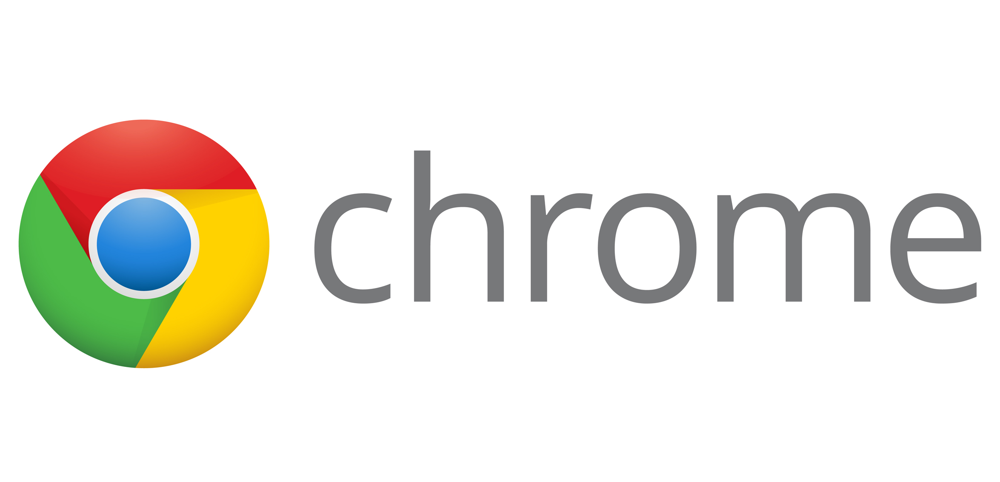

# Google-Chrome
My works related to Google Chrome

## Table of Contents
1. [Introduction.](#introduction)
2. [Official references websites.](#references)
3. [Google Chrome shortcuts.](#shortcuts)
4. [Google Chrome cache history.](#cache)
5. [Google Chrome scratch pad.](#scratchpad)
6. [GitHub notes.](#github)

<a name="introduction"></a>
## 1. Introduction.
 
Google Chrome is a cross-platform web browser developed by Google. It was first released in 2008 for Microsoft Windows, and was later ported to Linux, macOS, iOS, and Android. The browser is also the main component of Chrome OS, where it serves as the platform for web apps.

Most of Chrome's source code comes from Google's open-source Chromium project, but Chrome is licensed as proprietary freeware. WebKit was the original rendering engine, but Google eventually forked it to create the Blink engine; all Chrome variants except iOS now use Blink.

As of July 2019, StatCounter estimates that Chrome has a 71% worldwide browser market share on traditional PCs and 63% across all platforms. Because of this success, Google has expanded the "Chrome" brand name to other products: Chrome OS, Chromecast, Chromebook, Chromebit, Chromebox, and Chromebase.

<a name="references"></a>
## 2. Official references websites.
Official Google Chrome website : https://www.google.com/chrome/ <br />

<a name="shortcuts"></a>
## 3. Google Chrome shortcuts.
**_Scroll management_** <br />
**[ SPACE BAR ]** : scroll down faster <br />
**[ Shift ]** + **[ SPACE BAR ]** : scroll up faster <br />

**_Tabs management_** <br />
**--- { -3 } --- { -2 } --- { -1 } --- { current tab } --- { 1 } --- { 2 } --- { 3 } ---** <br />
**[ Ctrl ]** + **[ Shift ]** + **[ T ]** : open back the last recently closed { -1 } tab (first hit) <br />
**[ Ctrl ]** + **[ Shift ]** + **[ T ]** : open back the last recently closed { -2 } tab (second hit) <br />
**[ Ctrl ]** + **[ Shift ]** + **[ T ]** : open back the last recently closed { -3 } tab (second hit) <br />

<a name="github"></a>
## 4. Google Chrome cache history.
If the website is down, you can view what is the last happened on the website by adding prefix `cache:` in front of the address link on the Google Chrome address bar. For example `https://www.google.com` -- changed into --> `cache:https://www.google.com` and hit **[ Enter ]** using your keyboard.

It will show this kind of example message, with the option below it to view as ` Full version` or `Text-only` or `View source`.
```
This is Google's cache of http://www.google.com/. It is a snapshot of the page as it appeared on 4 Feb 2020 06:06:59 GMT. The current page could have changed in the meantime. Learn more.
```
<a name="scratchpad"></a>
## 5. Google Chrome scratch pad.
Copy and paste the below codes on Google Chrome browser address bar and you will have a scratchpad that have blank working space to work with.
```
data:text/html;charset=utf-8, <title>Scratchpad</title><style>body {padding: 5%; font-size: 1.5em; font-family: Arial; }"></style><link rel="shortcut icon" href="https://ssl.gstatic.com/docs/documents/images/kix-favicon6.ico"/><body OnLoad='document.body.focus();' contenteditable spellcheck="true" >
```

<a name="github"></a>
## 6. GitHub notes.
Clone the current GitHub remote repository contents into local machine.
```
$ git clone https://github.com/syakirharis25/Google-Chrome.git
$ cd Google-Chrome/
$ git remote -v
$ git status
